# FinVerify OS Architecture

FinVerify OS is an upload-based, rule-first finance verification system. The browser never receives AI provider keys, deterministic matching remains authoritative, and every compliance concern is routed as "Potential risk — needs CA review."

## High-Level Flow

```mermaid
flowchart LR
  user["Founder / Finance Team / CA"]
  frontend["React + Vite Frontend"]
  api["Express API Server /api/*"]

  upload["Upload Pipeline<br/>CSV / Excel / PDF / Image"]
  auth["Auth + Permissions<br/>JWT Sessions<br/>Company Scoped Access"]
  validation["File Validation<br/>Type, Size, Source Type"]
  audit["Audit Logging Service"]
  db["Neon Postgres<br/>Drizzle ORM"]

  rules["Rules-First Matching Engine"]
  reports["Reports & Exports"]
  risk["Risk Engine<br/>Potential risk — needs CA review"]
  caQueue["CA Review Queue"]

  r2["Cloudflare R2<br/>Private File Storage"]
  parser["Parser & Extractor<br/>CSV / Excel / PDF Text"]
  parsed["Parsed Result<br/>Rows / Text / PDF Pages / Metadata"]
  mapping["Mapping Preview<br/>Column Mapping / Text Preview"]

  runAi["Run AI Extraction Button"]
  aiRouter["AI Provider Router<br/>Server-side Only"]
  gemini["Gemini Primary"]
  nvidia["NVIDIA Fallback"]
  openrouter["OpenRouter Optional<br/>Disabled by Default"]
  fallback["Rule-Based Fallback"]
  safeJson["Safe JSON Parser + Zod Validation"]
  pending["AI Extraction Result<br/>Pending Review"]
  human["Human Review<br/>Accept / Edit / Reject"]
  invoice["Invoice Record<br/>Pending Reconciliation"]

  user --> frontend --> api
  api --> upload
  api --> auth

  upload --> validation
  upload --> audit
  validation --> db
  audit --> db
  auth --> db

  db --> rules
  rules --> reports
  rules --> risk
  risk --> caQueue
  reports --> r2

  validation --> r2
  r2 --> parser
  parser --> parsed
  parsed --> mapping
  mapping --> runAi
  runAi --> aiRouter

  aiRouter --> gemini
  aiRouter --> nvidia
  aiRouter --> openrouter
  aiRouter --> fallback

  gemini --> safeJson
  nvidia --> safeJson
  openrouter --> safeJson
  fallback --> safeJson

  safeJson --> pending
  pending --> human
  human --> invoice
  invoice --> db

  parsed --> db
  pending --> db
  human --> db
  invoice --> rules
```

## Architectural Rules

- The product is upload-based unless a live integration is explicitly implemented in code.
- CSV and Excel uploads can import rows into the relevant finance tables for reconciliation.
- PDF uploads are parsed for text, pages, metadata, and review previews; reliable row import is source/file dependent.
- Cloudflare R2 is private file storage when configured; Neon stores metadata and finance records.
- The rules-first matching engine is the source of financial truth.
- AI is optional, server-side only, schema-validated, and always pending review.
- OpenRouter is disabled by default and only an emergency fallback when explicitly enabled.
- Accepted invoice extraction creates an invoice record with `pending_reconciliation`, not verified status.
- Compliance and risk language must use: "Potential risk — needs CA review."

## Core Components

- Frontend: React, Vite, TypeScript, TailwindCSS, app shell, upload center, reconciliation, reports, and review screens.
- API: Express routes under `/api/*`, authentication, permissions, uploads, reports, reconciliation, risks, and AI endpoints.
- Database: Neon/PostgreSQL through Drizzle ORM.
- Storage: metadata-only by default, private R2/S3-compatible storage when configured.
- Upload pipeline: validates source type, stores metadata/file, parses content, imports supported rows, logs audit events.
- Matching engine: compares bank transactions, invoices, ledger entries, payroll, and gateway settlements using deterministic rules.
- Risk engine: generates review items without claiming legal, tax, audit, fraud, GST, or TDS certainty.
- AI provider router: Gemini primary, NVIDIA fallback, OpenRouter optional, rule-based fallback.
